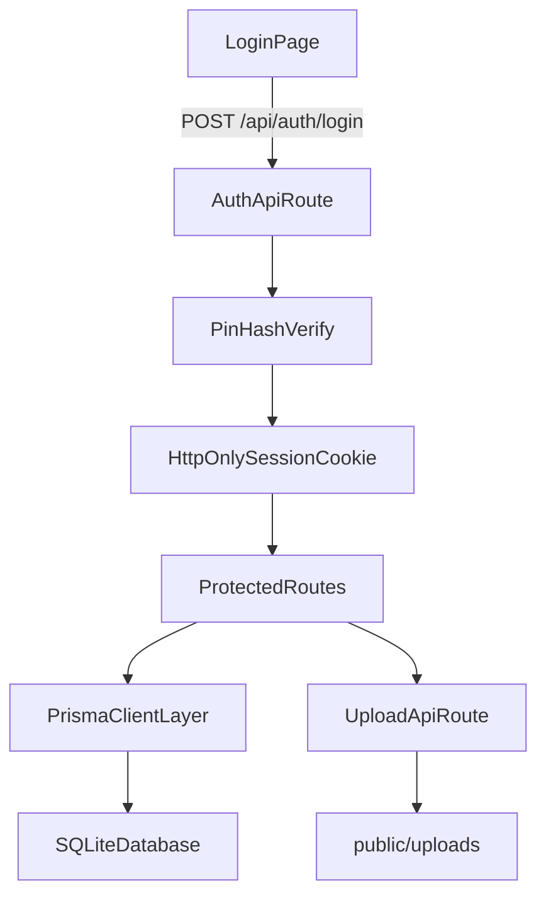

# KanColle Hub 开发蓝图

## 目标与边界

- 技术栈固定：Next.js 14 App Router + TypeScript + Tailwind CSS + shadcn/ui + Prisma + SQLite。
- 单体应用，不拆前后端，不引入 NextAuth/OAuth/邮件验证。
- 认证采用「用户名下拉 + 4位PIN」；根据你的选择，`pinCode` 使用哈希存储。
- 图片采用服务器本地存储（`uploads` 目录），数据库仅存相对路径 `imageUrl`。
- 用户舰船数据采用「整包 JSON 字符串落库」：`User.shipData`。

## 标准化目录结构（建议直接按此搭建）

- [package.json](package.json)
- [next.config.ts](next.config.ts)
- [tsconfig.json](tsconfig.json)
- [postcss.config.js](postcss.config.js)
- [.env](.env)
- [.env.example](.env.example)
- [prisma/schema.prisma](prisma/schema.prisma)
- [prisma/seed.ts](prisma/seed.ts)
- [prisma/migrations/](prisma/migrations/)
- [src/app/layout.tsx](src/app/layout.tsx)
- [src/app/globals.css](src/app/globals.css)
- [src/app/page.tsx](src/app/page.tsx)
- [src/app/login/page.tsx](src/app/login/page.tsx)
- [src/app/logout/route.ts](src/app/logout/route.ts)
- [src/app/(protected)/dashboard/page.tsx](src/app/(protected)/dashboard/page.tsx)
- [src/app/(protected)/routine/page.tsx](src/app/(protected)/routine/page.tsx)
- [src/app/(protected)/strategy/page.tsx](src/app/(protected)/strategy/page.tsx)
- [src/app/(protected)/lock-plan/page.tsx](src/app/(protected)/lock-plan/page.tsx)
- [src/app/api/auth/login/route.ts](src/app/api/auth/login/route.ts)
- [src/app/api/auth/me/route.ts](src/app/api/auth/me/route.ts)
- [src/app/api/users/ship-data/route.ts](src/app/api/users/ship-data/route.ts)
- [src/app/api/routine/route.ts](src/app/api/routine/route.ts)
- [src/app/api/strategy/route.ts](src/app/api/strategy/route.ts)
- [src/app/api/lock-plan/route.ts](src/app/api/lock-plan/route.ts)
- [src/app/api/upload/route.ts](src/app/api/upload/route.ts)
- [src/lib/prisma.ts](src/lib/prisma.ts)
- [src/lib/auth.ts](src/lib/auth.ts)
- [src/lib/session.ts](src/lib/session.ts)
- [src/lib/validators.ts](src/lib/validators.ts)
- [src/lib/storage.ts](src/lib/storage.ts)
- [src/components/ui/](src/components/ui/)
- [src/components/common/app-shell.tsx](src/components/common/app-shell.tsx)
- [src/components/auth/login-form.tsx](src/components/auth/login-form.tsx)
- [src/components/routine/routine-form.tsx](src/components/routine/routine-form.tsx)
- [src/components/strategy/strategy-editor.tsx](src/components/strategy/strategy-editor.tsx)
- [src/components/lock-plan/lock-plan-board.tsx](src/components/lock-plan/lock-plan-board.tsx)
- [src/middleware.ts](src/middleware.ts)
- [public/uploads/](public/uploads/)

## Prisma Schema 最终版（可直接运行）

路径：[prisma/schema.prisma](prisma/schema.prisma)

```prisma
generator client {
  provider = "prisma-client-js"
}

datasource db {
  provider = "sqlite"
  url      = env("DATABASE_URL")
}

model User {
  id            String          @id @default(cuid())
  name          String          @unique
  pinCode       String
  shipData      String?
  routineRecords RoutineRecord[]
  lockPlans     LockPlan[]
  createdAt     DateTime        @default(now())
  updatedAt     DateTime        @updatedAt
}

model RoutineRecord {
  id          String   @id @default(cuid())
  userId      String
  seaArea     String
  missionName String
  airControl  Int
  note        String?
  imageUrl    String?
  createdAt   DateTime @default(now())
  updatedAt   DateTime @updatedAt

  user User @relation(fields: [userId], references: [id], onDelete: Cascade)

  @@index([userId, seaArea])
  @@index([createdAt])
}

model StrategyPost {
  id            String   @id @default(cuid())
  phaseName     String
  title         String
  content       String
  fleetImageUrl String?
  airbaseImageUrl String?
  createdAt     DateTime @default(now())
  updatedAt     DateTime @updatedAt

  @@index([phaseName])
  @@index([createdAt])
}

model LockPlan {
  id            String   @id @default(cuid())
  userId        String
  tagName       String
  tagColorClass String
  assignedData  String
  note          String?
  createdAt     DateTime @default(now())
  updatedAt     DateTime @updatedAt

  user User @relation(fields: [userId], references: [id], onDelete: Cascade)

  @@index([userId])
  @@unique([userId, tagName])
}
```

### Schema 约束说明（供初级模型执行时遵守）

- `User.pinCode` 存哈希值（bcrypt/argon2 任一，推荐 bcrypt）。
- 4 位数字 PIN 校验在 API 层完成，数据库仅存哈希后的字符串。
- `User.shipData` 保存原始 JSON 字符串，不做拆表。
- `LockPlan.assignedData` 保存 JSON 字符串（推荐数组对象），优先于逗号分隔字符串。
- `tagColorClass` 白名单校验（仅允许 Tailwind 预设列表，防止注入类名）。

## 核心数据流（实现时按此顺序）




## 分阶段开发指南（5个可独立验收 Milestones）

### Milestone 1：项目骨架 + UI 基础 + Prisma 初始化

- 目标：搭建可运行的基础项目，完成依赖安装、Tailwind、shadcn/ui、Prisma 初始化。
- 实施点：
  - 建立目录结构与基础页面骨架（`src/app` + 路由分组）。
  - 配置 Prisma 与 SQLite，写入最终 `schema.prisma`。
  - 执行迁移并生成 Prisma Client。
  - 初始化一组测试用户（seed），PIN 以哈希形式写入。
- 验收标准：
  - `npm run dev` 正常启动。
  - `prisma migrate dev` 成功执行。
  - 数据库存在 `User/RoutineRecord/StrategyPost/LockPlan` 四表。

### Milestone 2：极简登录鉴权（用户名+4位PIN）

- 目标：实现可用的最小认证系统与受保护页面。
- 实施点：
  - 登录页：用户名下拉 + PIN 输入框（仅 4 位数字）。
  - 登录 API：校验用户、比对 PIN 哈希、写入 HttpOnly Cookie。
  - 中间件：拦截 `(protected)` 路由，未登录重定向 `/login`。
  - `me` 与 `logout` 接口完成基础会话闭环。
- 验收标准：
  - 正确 PIN 可登录并进入 Dashboard。
  - 错误 PIN 提示明确。
  - 手动删除/过期 Cookie 后访问受保护页会被重定向。

### Milestone 3：个人数据中心（shipData JSON 存档）

- 目标：完成舰船 JSON 导入、持久化、读取与前端内存解析。
- 实施点：
  - 提供上传/粘贴 JSON 的入口，仅允许当前用户写入自己的 `shipData`。
  - API 保存原始字符串，不做关系化拆表。
  - 页面读取 `shipData` 后 `JSON.parse`，并在客户端做列表/筛选展示。
  - 增加 JSON 格式防呆与大小限制提示。
- 验收标准：
  - 导入后刷新页面数据仍存在。
  - 非法 JSON 会被拦截并提示。
  - A 用户不能读写 B 用户 `shipData`。

### Milestone 4：周回记录板 + 图片上传

- 目标：实现个人周回记录 CRUD 与截图能力。
- 实施点：
  - `RoutineRecord` 新增/编辑/删除/列表。
  - 字段覆盖：海域、任务名、制空值、备注、截图路径。
  - 上传 API 保存图片到 `public/uploads`，返回 `imageUrl`。
  - 列表按时间倒序，支持按海域过滤。
- 验收标准：
  - 每个用户仅可见自己的周回记录。
  - 图片上传后可在记录卡片展示。
  - 删除记录后图片路径不再被引用（是否物理删文件可后续迭代）。

### Milestone 5：攻略贴（全局）+ 个人锁船规划（防呆）

- 目标：完成核心协同功能，替代 Google Docs 的关键痛点。
- 实施点：
  - `StrategyPost`：全员可读写的图文攻略贴（阶段名、正文、截图）。
  - `LockPlan`：用户私有标签计划（标签名、颜色、assignedData、备注）。
  - 锁船防呆：在前端解析 `shipData` + `assignedData`，阻止同一船在冲突场景重复分配并给出提示。
  - 标签颜色使用白名单映射（避免任意类名输入）。
- 验收标准：
  - 攻略贴可按阶段查看与维护。
  - 锁船规划可编辑并持久化。
  - 重复分配触发防呆提示，不会静默写入冲突数据。

## 给初级模型的统一执行约束（每阶段 Prompt 尾部重复）

- 严禁引入 NextAuth、OAuth、复杂消息队列、缓存层、微服务。
- API 统一放在 App Router Route Handlers。
- 所有写操作都必须校验当前登录用户身份。
- 表单校验优先 `zod`（轻量且直观）。
- 代码风格保持小文件、低耦合、可读优先。

